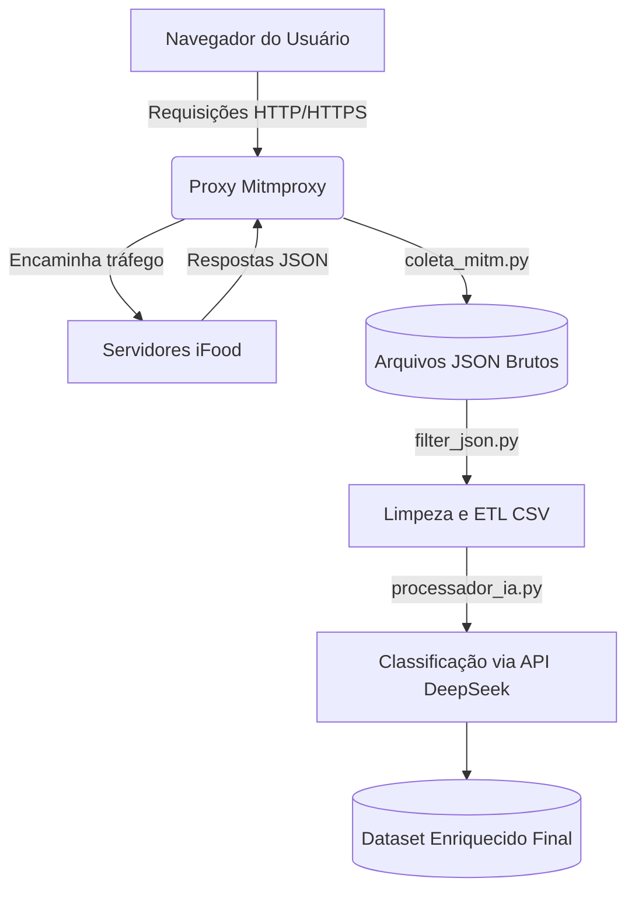
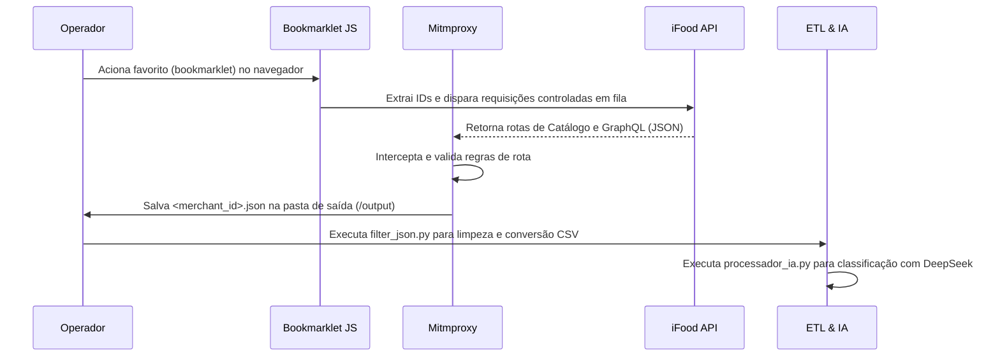

# Extração e Processamento de Dados do iFood

Este documento estabelece o padrão arquitetural e operacional para o pipeline de extração de dados da plataforma iFood, com foco na técnica híbrida de interceptação de tráfego (via `mitmproxy`), seguida pelas etapas de extração, transformação e carga (ETL) e enriquecimento semântico utilizando Inteligência Artificial (DeepSeek).

O sistema resolve o problema das severas limitações antibot (como PerimeterX e Cloudflare) ao utilizar o tráfego orgânico do navegador do usuário para capturar catálogos e informações de lojas dinamicamente, processando e classificando os dados nutricionais em escala para análises posteriores.

---

## 1. Introdução

O pipeline de dados é composto por três componentes centrais: captura de tráfego, limpeza e transformação (ETL), e classificação inteligente. A interceptação ocorre localmente utilizando o `mitmproxy` integrado a um navegador com roteamento configurado. Os payloads interceptados das rotas GraphQL e REST do iFood são salvos em formato JSON. Em seguida, regras de negócio purificam o dataset (removendo anomalias e categorias indesejadas) antes que uma LLM realize a decomposição estruturada de marmitas e pratos da culinária brasileira.



## 2. Pré-requisitos e Contexto

Para executar e gerenciar a esteira completa, os seguintes requisitos sistêmicos e organizacionais devem ser atendidos:

**Ambiente e Rede:**

- Navegador web configurado com extensão de gerenciamento de proxy (ex: FoxyProxy Standard) apontando para `127.0.0.1:8080`.
- Instalação do certificado de autoridade raiz do `mitmproxy` no navegador (`mitm.it`) para descriptografia de tráfego HTTPS.


**Dependências de Software:**

- Python 3.9+.
- Pacotes: `mitmproxy`, `openai`, `playwright`.


**Credenciais e Variáveis de Ambiente:**

- `<CHAVE_API_DEEPSEEK>` configurada para a etapa de classificação semântica.


**Organização de Diretórios:**

- Estrutura de pastas de saída parametrizada (ex: diretório `./output` e diretórios com nomes de regiões `sudeste`, `nordeste`).


## 3. Estruturação e Setup

A configuração inicial abrange a subida do servidor proxy local, a injeção dos scripts utilitários e a parametrização do ambiente de banco de dados e arquivos.

### Inicialização do Interceptador (mitmproxy)

O módulo `coleta_mitm.py` atua como um addon para o `mitmproxy`. Ele deve ser iniciado no terminal sob protocolo HTTP/1.1 para contornar problemas de multiplexação e parsing de cabeçalhos complexos do HTTP/2.

```bash
# Iniciar a escuta do tráfego forçando o protocolo HTTP/1.1
mitmdump -s src/coleta_mitm.py --set http2=false -q

```

### Configuração dos Bookmarklets de Coleta
Configuração dos Bookmarklets de ColetaPara dinamizar a extração diretamente pelo navegador, os scripts JavaScript de automação foram otimizados e minimizados para uso em bookmarks. O operador deve copiar o código minimizado de um arquivo de script e salvá-lo como o URL de um favorito no navegador, iniciando com o prefixo javascript:

- **Script de Varredura e Disparo de Catálogo (fetch_ifood_api.js):** Injeta requisições sequenciais contornando restrições de coordenadas logísticas e coletando dados de lojistas mapeados na tela.   
- **Script de Abertura Sincronizada (open_restaurant_page.js):** Abre abas controladas de restaurantes e valida o status de salvamento iterativo comunicando-se com rotas locais do Python.

### Setup do Motor ETL

O script `filter_json.py` requer uma estrutura de diretórios baseada em regiões geográficas ou estados para processamento em lote.

```bash
# O sistema espera que exista uma pasta contendo subpastas por estado
python filter_json.py <NOME_DA_REGIAO_OU_PASTA>

```

### Parametrização da Inteligência Artificial

Para o `processador_ia.py`, é necessário um arquivo de texto com as definições de domínio (ex: `alimentos_definicoes.txt`) e a injeção da chave de API no código ou via variável de ambiente.

```python
# processador_ia.py - Estrutura de configuração
CHAVE_API = "<SUA_CHAVE_AQUI>"
MODELO = "deepseek-chat"
TAMANHO_LOTE_CHECKPOINT = 500

```

## 4. Aplicação Prática

A rotina de execução ocorre em cascata. O fluxo operacional é definido pelos seguintes passos diários:

1. **Ativação da Coleta Híbrida:** O operador inicia o `mitmdump` via terminal. Com o FoxyProxy ativo, o operador navega pelo site do iFood. O script intercepta automaticamente as rotas `/catalog` e `site-api/v1/merchant-info/graphql`, salvando os JSONs em `./output`.
2. **Execução via Bookmarklet:** O operador navega até a página de listagem de restaurantes do iFood e clica no favorito configurado com o script minimizado. O script extrai os IDs dinâmicos de entrega e dispara as requisições controladas de catálogo para captura em segundo plano.
3. **Persistência de Dados:** O addon processa os headers e payloads interceptados das rotas de catálogo e GraphQL, gravando arquivos JSON estruturados no diretório de saída.
4. **ETL e Enriquecimento:** Executam-se os scripts de conversão e limpeza (`filter_json.py`) para remoção de ruídos e, por fim, o motor de inteligência artificial (`processador_ia.py`) para categorização estruturada dos pratos.



## 5. Casos de Uso e Exemplos

### Interceptação Automática de Respostas da API

O código abaixo demonstra como a ferramenta isola a requisição do catálogo a partir do tráfego massivo. Se a URL coincidir e o status HTTP for `200`, o payload é injetado no armazenamento pendente.

```python
# Trecho adaptado de coleta_mitm.py
if "/catalog" in url and "site-api/v1/merchants/restaurant" in url:
    if flow.response.status_code == 200:
        match = re.search(r'/restaurant/([a-f0-9\-]+)/catalog', url)
        if match:
            restaurante_id = match.group(1)
            # Aciona método interno de persistência local
            self._iniciar_restaurante(restaurante_id)
            self.dados_pendentes[restaurante_id]["catalogo_loja"] = json.loads(flow.response.text)
            self._verificar_e_salvar(restaurante_id)

```

### Exemplo de Script JavaScript Minimizado para Bookmark

Abaixo encontra-se a estrutura lógica do script responsável por extrair os identificadores dos restaurantes exibidos na interface e injetar requisições controladas com espaçamento estocástico de tempo para evitar bloqueios de segurança:   JavaScriptjavascript:(async 
```javascript
() => {
    const elementos = Array.from(document.querySelectorAll('a[href*="/delivery/"]'));
    const restaurantes = [];
    const idsProcessados = new Set();

    elementos.forEach(el => {
        const parts = el.href.split('/');
        const rId = parts[parts.length - 1].split('?')[0]; 
        if (rId.length > 20 && !idsProcessados.has(rId)) {
            idsProcessados.add(rId);
            restaurantes.push(rId);
        }
    });
    console.log(` Mapeados ${restaurantes.length} restaurantes para extração via bookmarklet.`);
})();
```

### Prompt Arquitetural para IA de Nutrição

O módulo `processador_ia.py` utiliza formatação rigorosa via JSON para forçar a LLM a retornar dados exatos, restringindo alucinações. O prompt exige que a LLM valide a pertinência do prato (se é marmita/comida brasileira) e extraia os constituintes da refeição.

```json
// Saída esperada da LLM após o processamento da descrição de um prato
{
    "eh_alimento": true,
    "extracao_texto": {
        "prato_principal": "Bife Acebolado",
        "prato_vegetariano_principal": "",
        "guarnicao": "Fritas",
        "salada": "Alface e Tomate",
        "acompanhamento": "Arroz e Feijão",
        "sobremesa": "",
        "bebida": "",
        "outros_carboidratos": "Farofa"
    },
    "marcadores_x": {
        "Carne Vermelha": "X",
        "Frita": "X",
        "Frita (Guarnicao)": "X",
        "Arroz branco simples": "X",
        "Feijão simples": "X"
    }
}

```

## 6. Desafios Comuns e Soluções

1. **Problema: Interrupção por Timeout ou Erro na API do DeepSeek.**
* *Solução:* O sistema foi desenhado com um mecanismo nativo de checkpoint (`TAMANHO_LOTE_CHECKPOINT = 500`). Se a execução cair, ao reiniciar apontando para o mesmo arquivo original de saída, o motor ativará o "Modo de Retomada" via função `carregar_itens_ja_processados`, pulando automaticamente as chaves `(Restaurante, Nome do Prato)` já concluídas e retomando do ponto exato de falha.


2. **Problema: Certificado de Proxy Inválido Bloqueando a Navegação.**
* *Solução:* Navegadores modernos barram tráfego HTTPS descriptografado no meio do caminho (MITM). Certifique-se de que o proxy está ativo (porta 8080), acesse o domínio dentro do navegador configurado e baixe a chave primária. Instale-a nas configurações de "Autoridades de Certificação Raiz Confiáveis" (Trust Root CA) do seu navegador ou sistema operacional.


3. **Problema: Arquivos JSON não sendo gerados, mesmo com tráfego capturado.**
* *Solução:* O addon `coleta_mitm.py` requer a captura de dois componentes antes de consolidar o arquivo: os *metadados do restaurante* (GraphQL) e o *catálogo* (REST). Se a navegação não forçar o carregamento de ambos, o ID permanecerá no dicionário `self.dados_pendentes`. Pressione `F5` na página do restaurante afetado para re-disparar as requisições primárias.


## 7. Referências

* [Documentação Oficial Mitmproxy](https://www.google.com/search?q=https://docs.mitmproxy.org/stable/&utm_source=gemini)
* [DeepSeek API Reference](https://www.google.com/search?q=https://platform.deepseek.com/api-docs/&utm_source=gemini)
* [Repositório Interno - coleta_mitm.py](https://github.com/PiJunior-UFMG/Projeto_Ifood/blob/main/src/coleta_mitm.py)
* [Repositório Interno - filter_json.py](https://github.com/PiJunior-UFMG/Projeto_Ifood/blob/main/scripts/filter_json.py)
* [Repositório Interno - processador_ia.py](https://github.com/PiJunior-UFMG/Projeto_Ifood/blob/main/scripts/processador_ia.py)
* [Minificador de JavaScript para Bookmarklets: Toptal JS Minifier](https://www.toptal.com/developers/javascript-minifier?utm_source=gemini)