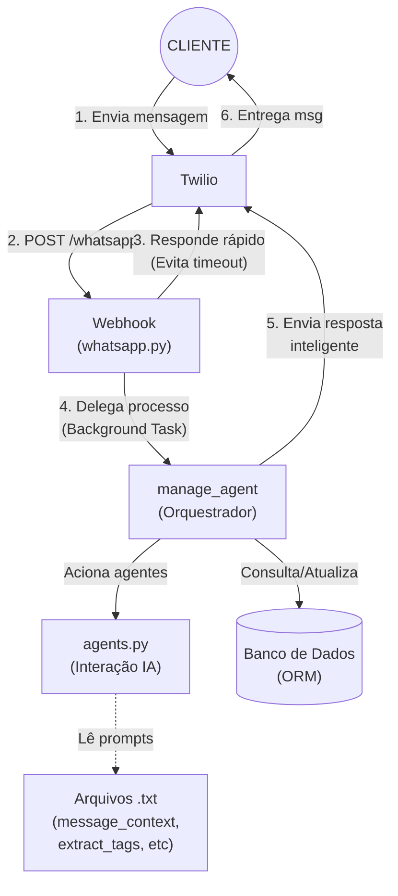

# ChatBot: PiImportadora

Sistema B2B de atendimento automatizado via WhatsApp integrado à inteligência artificial (DeepSeek) para classificação de intenções, recomendação de produtos e gerenciamento da jornada de compras em tempo real.

---

## 1. Introdução

O projeto consiste em um assistente de vendas em formato de prova de conceito (PoC). O objetivo é demonstrar a viabilidade de um fluxo conversacional assíncrono e integrado a dados, onde a IA orquestra o diálogo baseando-se no histórico de consumo do cliente e no catálogo do banco de dados. A aplicação backend foi construída para alta performance de I/O, utilizando FastAPI e SQLAlchemy assíncrono, garantindo uma resposta rápida às requisições provenientes da API do WhatsApp.

## 2. Pré-requisitos

Para que o ambiente de desenvolvimento seja configurado adequadamente, é necessário possuir:

* **Python 3.10+**: Linguagem base do projeto.
* **API do Twilio**: Conta ativa com credenciais configuradas (`ACCOUNT_SID` e `AUTH_TOKEN`), além de um número de testes no Twilio Sandbox for WhatsApp.
* **API do DeepSeek**: Chave de acesso (`DEEPSEEK_API_KEY`) para chamadas ao modelo `deepseek-chat`.
* **ngrok**: Ferramenta indispensável em ambiente local para expor a porta da aplicação (localhost) em um endpoint público seguro (HTTPS), necessário para configurar o webhook de recebimento do Twilio.
* **Banco de Dados**: SQLite habilitado (padrão) com driver assíncrono (`aiosqlite`) ou PostgreSQL local.

## 3. Configuração

1. **Variáveis de Ambiente**: Na raiz do seu projeto, crie o arquivo `.env` para abrigar as credenciais críticas e a URL do banco:
   ```env
   DEEPSEEK_API_KEY="sk-sua-chave-aqui"
   TWILIO_ACCOUNT_SID="AC-seu-sid"
   TWILIO_AUTH_TOKEN="seu-token"
   TWILIO_NUMBER="whatsapp:+14155238886"
   # DATABASE_URL="sqlite+aiosqlite:///./test.db" (Padrão no código)

    ```

2. **Expondo a Porta para Testes com ngrok**:
O Twilio necessita de uma URL pública para bater com o Payload da mensagem. Execute o ngrok na mesma porta do servidor Uvicorn:
```bash
ngrok http 8000

```


Copie a URL `https` retornada pelo ngrok e adicione ao campo de Webhook do seu número no painel do Twilio, apontando para a rota criada: `https://<url-do-ngrok>.ngrok-free.app/whatsapp`.
3. **Iniciando o Bot**:
Com tudo configurado, rode a aplicação para gerar as tabelas e subir o servidor simultaneamente:
```bash
python main.py --create-db --run-server

```


## 4. Arquitetura do projeto

A arquitetura orientada a eventos funciona desmembrando a resposta imediata de recebimento do processamento pesado da IA.

### Interações do Orquestrador e Agentes

A arquitetura orientada a eventos desmembra a resposta imediata (para evitar timeouts no Twilio) do processamento pesado da IA. O diagrama abaixo ilustra de forma simplificada como os componentes interagem desde o recebimento da mensagem até a resposta final.



### O Dashboard de Configuração (/dashboard)

A página administrativa `dashboard.py` foi renderizada de forma SSR (Server-Side Rendering) via `Jinja2Templates` e tem dois papéis centrais:

* **Gestão Operacional Dinâmica**: Dispõe formulários de POST (ex: `/supplier/add`, `/product/{id}/edit`) permitindo que administradores criem ou atualizem as tags de Fornecedores e Produtos instantaneamente. Isso altera dinamicamente como a IA sugere os itens.
* **Auditoria de IA e Conversão**: Apresenta a relação consolidada de compras atreladas aos Clientes, além das métricas essenciais como o consumo médio e total de Tokens dos agentes (via leitura assíncrona do `agent_metrics.log`), garantindo visibilidade dos custos.

### Decisões de Tecnologia

* **SQLAlchemy (ORM 2.0)**: Escolhido pela tipagem avançada e operação assíncrona robusta. Implementamos **herança polimórfica** na tabela `User` que se divide em `Client` e `Seller`, economizando queries e isolando regras de negócio em um único local, o que escala super bem para adicionar novos perfis.
* **Cache Volátil em Memória (`user_cache`)**: Utilizou-se um simples dicionário para rastrear os "steps" temporários e as listas de sugestões no meio de uma transação. Isso agiliza o PoC, reduz o I/O em banco de dados, mas não garante persistência ao resetar o servidor.

## 5. Como podemos reutilizar este código

Sendo um Projeto Conceito (PoC), a arquitetura `Webhook -> BackgroundTask -> Agentes_IA` pode ser reaproveitada para inúmeros setores:

* **Adaptação para Serviços/Agendamentos**: Basta alterar o `models.py` substituindo as classes de `Supplier` e `Product` por `Doctor` e `Schedule`.
* **Mudança da Personalidade do Bot**: Toda a percepção e limite de comportamento do bot residem na pasta `/prompts`. Editar o texto do `message_context.txt` e `recommend_products.txt` mudará o nicho rapidamente de Vendas para Suporte Técnico, sem a necessidade de reescrever lógica Python.
* **Migração do Cache (Prioridade Alta)**: Para escalar em produção multi-workers, você pode começar substituindo o dicionário `user_cache` em `whatsapp.py` por conexões Redis. O esqueleto lógico do estado de sessão continuará o mesmo.

## 6. Referências

* [FastAPI Async Documentation](https://fastapi.tiangolo.com/async/)
* [Twilio Webhooks & TwiML](https://www.google.com/search?q=https://www.twilio.com/docs/usage/webhooks/whatsapp-webhooks)
* [DeepSeek API References](https://platform.deepseek.com/api-docs)
* [SQLAlchemy Asyncio ORM](https://docs.sqlalchemy.org/en/20/orm/extensions/asyncio.html)
* [Ngrok - Expondo serviços locais](https://ngrok.com/docs)