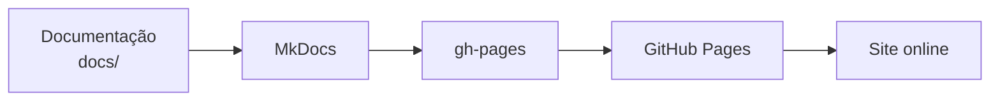
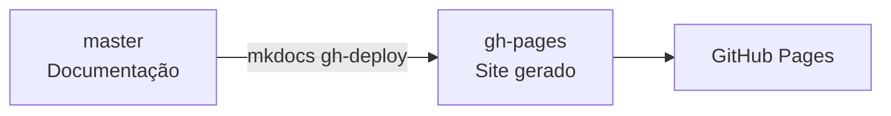
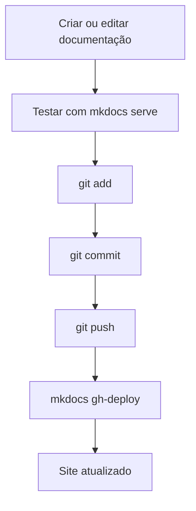
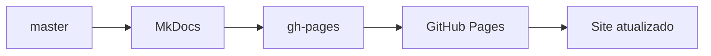
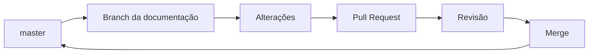

# Manual de Documentação

Este manual define o processo padrão para **criar, organizar, revisar e publicar documentação** no `pi-lib`, nosso portal de documentação técnica hospedado pelo GitHub Pages.

O objetivo é manter a documentação da PI Junior organizada, consistente e fácil de manter.

---

## 1. O que é o `pi-lib`?

O `pi-lib` é o repositório utilizado para armazenar e publicar a documentação técnica da PI Junior.

Os documentos são escritos em **Markdown** e transformados em um site utilizando o **MkDocs**.

O processo de publicação é simples:



O site está disponível em:

**https://pijunior-ufmg.github.io/pi-lib/**

---

## 2. Estrutura do projeto

A estrutura principal do projeto é:

```text
pi-lib/
├── docs/
│   ├── index.md
│   ├── ferramentas/
│   │   ├── git-github.md
│   │   └── documentacao.md
│   └── projetos/
│       └── exemplo.md
│
├── mkdocs.yml
├── .gitignore
└── .git/
```

### `docs/`

É a pasta onde ficam os arquivos da documentação.

Todo novo conteúdo deve ser criado dentro dela.

Exemplo:

```text
docs/
├── index.md
├── ferramentas/
│   ├── git-github.md
│   └── docker.md
├── projetos/
│   ├── projeto-a.md
│   └── projeto-b.md
└── processos/
    └── desenvolvimento.md
```

### `mkdocs.yml`

É o arquivo de configuração do MkDocs.

Nele são definidos elementos como:

- nome do site;
- tema;
- navegação;
- plugins;
- extensões;
- configurações gerais.

### `site/`

A pasta `site/` contém os arquivos gerados pelo MkDocs.

**Não edite essa pasta manualmente.**

Ela é criada/atualizada automaticamente durante a publicação.

---

## 3. Organização das branches

O projeto possui duas branches importantes:

- `master`: arquivos originais da documentação;
- `gh-pages`: versão compilada do site.

O fluxo é:



### `master`

É onde o trabalho deve ser realizado.

Contém:

```text
docs/
mkdocs.yml
.gitignore
```

### `gh-pages`

É utilizada pelo GitHub Pages para disponibilizar o site.

A `gh-pages` deve ser atualizada através do MkDocs.

**Não faça alterações manuais nessa branch.**

Também não é necessário fazer:

```bash
git switch gh-pages
```

para adicionar uma nova página.

---

## 4. Criando uma nova página

Crie o arquivo dentro de `docs/`.

Por exemplo:

```bash
touch docs/ferramentas/docker.md
```

Depois edite o arquivo:

```markdown
# Docker

Docker é uma plataforma utilizada para criar e executar aplicações
em ambientes isolados chamados containers.

## Instalação

...

## Comandos básicos

...
```

---

## 5. Organização dos arquivos

Evite colocar todos os documentos diretamente dentro de `docs/`.

Organize os arquivos de acordo com o assunto.

Por exemplo:

```text
docs/
├── index.md
│
├── ferramentas/
│   ├── git-github.md
│   ├── docker.md
│   └── python.md
│
├── projetos/
│   ├── projeto-a.md
│   └── projeto-b.md
│
├── processos/
│   ├── desenvolvimento.md
│   └── deploy.md
│
└── tutoriais/
    ├── instalacao.md
    └── configuracao.md
```

Uma regra simples:

> **Organize as pastas de acordo com o assunto da documentação.**

---

## 6. Adicionando uma página ao menu

Criar um arquivo `.md` não significa que ele aparecerá automaticamente no menu.

A navegação é definida no `mkdocs.yml`.

Por exemplo:

```yaml
nav:
  - Início: index.md

  - Ferramentas:
      - Git e GitHub: ferramentas/git-github.md
      - Docker: ferramentas/docker.md
      - Python: ferramentas/python.md

  - Projetos:
      - Projeto A: projetos/projeto-a.md
      - Projeto B: projetos/projeto-b.md
```

O resultado será:

```text
Início

Ferramentas
├── Git e GitHub
├── Docker
└── Python

Projetos
├── Projeto A
└── Projeto B
```

Portanto, para adicionar uma nova página:

1. Crie o arquivo dentro de `docs/`;
2. Adicione o arquivo ao `nav` no `mkdocs.yml`.

---

## 7. Testando a documentação

Antes de publicar qualquer alteração, teste o site localmente.

Execute:

```bash
mkdocs serve
```

O MkDocs iniciará um servidor local, normalmente em:

```text
http://127.0.0.1:8000/
```

Abra o endereço no navegador.

O site local será atualizado automaticamente enquanto você editar os arquivos.

---

### O que verificar?

Antes de publicar, confira:

- conteúdo;
- ortografia;
- títulos;
- navegação;
- links;
- imagens;
- exemplos de código;
- formatação.

---

## 8. Fluxo de trabalho

O fluxo recomendado é:



Esse é o fluxo principal que os membros devem seguir.

---

## 9. Salvando alterações

Depois de terminar uma alteração, verifique:

```bash
git status
```

Adicione os arquivos:

```bash
git add .
```

Faça o commit:

```bash
git commit -m "docs: adiciona documentação sobre Docker"
```

Depois envie para o GitHub:

```bash
git push origin master
```

---

## 10. Padrão de commits

Utilize mensagens de commit claras.

### Nova documentação

```bash
git commit -m "docs: adiciona documentação sobre Docker"
```

### Atualização

```bash
git commit -m "docs: atualiza guia de Git"
```

### Correção

```bash
git commit -m "docs: corrige links da documentação"
```

### Configuração

```bash
git commit -m "chore: atualiza configuração do MkDocs"
```

Os principais prefixos são:

| Prefixo | Utilização |
|---|---|
| `docs:` | Documentação |
| `fix:` | Correções |
| `feat:` | Novas funcionalidades |
| `chore:` | Configuração e manutenção |
| `refactor:` | Reorganização |

---

## 11. Publicando o site

Depois de enviar as alterações para a `master`, execute:

```bash
mkdocs gh-deploy
```

Esse comando:

1. gera o site;
2. atualiza a `gh-pages`;
3. envia a nova versão para o GitHub Pages.

O processo é:



Após o comando, o site poderá ser acessado em:

**https://pijunior-ufmg.github.io/pi-lib/**

Pode levar alguns minutos para a atualização aparecer.

---

## 12. Trabalhando em equipe

Quando várias pessoas estiverem trabalhando na documentação, recomenda-se criar uma branch específica para cada alteração.

Por exemplo:

```bash
git switch master
git pull origin master

git switch -c docs/guia-docker
```

Faça as alterações e teste:

```bash
mkdocs serve
```

Depois:

```bash
git add .
git commit -m "docs: adiciona guia de Docker"
git push origin docs/guia-docker
```

No GitHub, abra um **Pull Request** para a `master`.

O fluxo será:



Depois que a alteração estiver na `master`, o site pode ser publicado com:

```bash
mkdocs gh-deploy
```

---

## 13. Adicionando imagens

Imagens podem ser organizadas dentro da pasta `docs`.

Por exemplo:

```text
docs/
├── ferramentas/
│   ├── git-github.md
│   └── imagens/
│       ├── git-flow.png
│       └── github-pr.png
```

No Markdown:

```markdown

```

Utilize caminhos relativos ao arquivo Markdown.

---

## 14. Padrão recomendado para documentos

Sempre que possível, utilize uma estrutura organizada:

```markdown
# Nome do Documento

Breve descrição sobre o objetivo deste documento.

---

## 1. Introdução

Explique o assunto.

## 2. Pré-requisitos

Liste o que é necessário.

## 3. Configuração

Explique como configurar.

## 4. Utilização

Explique como utilizar.

## 5. Exemplos

Apresente exemplos práticos.

## 6. Problemas comuns

Liste problemas e suas soluções.

## 7. Referências

Links e materiais complementares.
```

Essa estrutura não é obrigatória. O mais importante é que o conteúdo seja **claro, organizado e fácil de consultar**.

---

## 15. O que não fazer

### Não editar a `gh-pages`

A documentação deve ser alterada na `master`.

Não faça:

```bash
git switch gh-pages
```

para editar documentos.

---

### Não fazer merge manual com `gh-pages`

Não faça:

```bash
git switch gh-pages
git merge master
```

A publicação deve ser feita pelo MkDocs:

```bash
mkdocs gh-deploy
```

---

### Não editar arquivos dentro de `site/`

Arquivos como:

```text
site/index.html
site/assets/
site/search/
```

são gerados automaticamente.

Altere o arquivo Markdown correspondente dentro de `docs/`.

---

### Não publicar sem testar

Antes de publicar:

```bash
mkdocs gh-deploy
```

teste:

```bash
mkdocs serve
```

---

## 16. Documentação como conhecimento da empresa

A documentação do `pi-lib` deve funcionar como uma **base de conhecimento da PI Junior**.

Sempre que possível, documente:

- processos técnicos;
- ferramentas utilizadas;
- padrões de desenvolvimento;
- procedimentos de configuração;
- soluções para problemas recorrentes;
- decisões importantes;
- tutoriais;
- conhecimentos necessários para novos membros.

O objetivo é evitar que informações importantes fiquem restritas a uma única pessoa.

Uma boa documentação deve permitir que outro membro consiga entender e executar uma tarefa sem depender diretamente de quem realizou o trabalho anteriormente.

---
*Documentação mantida pela Diretoria de Projetos/TI.*